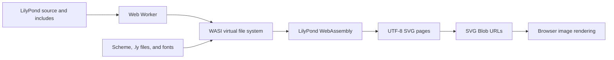

# LilyPond to WebAssembly Roadmap

This file records a plan for a small, pinned LilyPond WebAssembly build.  The
target accepts LilyPond source, runs the normal parser and engraving code, and
returns graphics that a browser can show.

The work should live in Nix expressions, a short patch set, a small WebAssembly
entry point, and a browser worker.  The upstream LilyPond checkout should stay
unchanged.  A later repository can pin LilyPond as a source input and apply the
same patches.

This plan is based on:

- LilyPond `v2.27.1-49-g9c1e4dc760`;
- the WASI build in
  [`../csound/wasm/src/csound.nix`](../csound/wasm/src/csound.nix);
- Nixpkgs revision `4db2c220f32fd162658ed1b7bb2f46a82996ddbe`;
- the LilyPond parser, engraving, font, and SVG output paths in this checkout.

## Summary

Use LilyPond's current SVG backend for the first browser build.  It already
writes one UTF-8 SVG file per page.  Send those bytes from a Web Worker, create
`image/svg+xml` blobs, and show them with `` elements.  Do not translate
SVG to WebGL.

Use two WebAssembly forms:

1. A WASI command module for tests under Wasmtime.
2. A browser-hosted module after the command build works.

Build the generated music fonts with native tools, then cross-build the engine
and its target libraries with `pkgs.pkgsCross.wasi32.clangStdenv`.

The first hard task is not the LilyPond SVG code.  It is a working WASI build of
Guile, BDW-GC, PangoFT2, Fontconfig, FreeType, and the text shaping stack.  Prove
each part with a small run test before patching much of LilyPond.

## Goals

- Accept normal `.ly` source and project includes.
- Use the normal LilyPond parser, Scheme code, engravers, spacing, and page
  breaking.
- Produce one SVG byte buffer per page.
- Keep fonts and run-time data fixed, local, and repeatable.
- Run untrusted jobs in a worker with no host file or network access.
- Pin Nixpkgs, LLVM, LilyPond, and every patch.
- Keep the source and final web files small.
- Leave upstream LilyPond untouched.

## Non-goals for the first build

- PDF or PostScript output.
- PNG output inside WebAssembly.
- A WebGL or WebGPU renderer.
- Multiple LilyPond jobs in one process.
- Dynamic Guile modules or LilyPond plug-ins.
- Host font discovery.
- A hand-picked set of engraver C++ files.
- Full point-and-click support.

## Proposed run path



The worker should:

1. Mount a read-only data pack.
2. Create writable `/work`, `/out`, and `/cache` directories.
3. Write the main source to `/work/main.ly`.
4. Write any allowed project includes below `/work`.
5. Run:

   ```text
   lilypond -fsvg -dpoint-and-click=#f -o /out/score /work/main.ly
   ```

6. Read `score.svg`, `score-2.svg`, and later page files.
7. Send diagnostics, status, and page buffers to the main thread.
8. End the worker for the first version.

The public JavaScript API can start with this shape:

```js
render(source, {
  includes: new Map(),
  pointAndClick: false
}) => Promise<{
  diagnostics: string,
  pages: Array<{
    index: number,
    mime: "image/svg+xml",
    bytes: ArrayBuffer
  }>
}>
```

Transfer whole page buffers.  Do not cross the JavaScript boundary for each
drawing command.

## Why SVG comes first

The SVG framework in [`scm/framework-svg.scm`](scm/framework-svg.scm) writes one
file per page.  [`scm/output-svg.scm`](scm/output-svg.scm) maps LilyPond stencil
commands to SVG paths, text, ellipses, transforms, and other SVG nodes.

This route:

- keeps vector zoom and print quality;
- needs no Ghostscript;
- needs no PDF decoder;
- avoids a large RGBA buffer;
- lets the browser use its own image code;
- supports page-by-page display and page reuse.

For a thumbnail, the browser can make an `ImageBitmap` from the SVG blob and
draw it to a canvas.

WebGL and WebGPU do not accept SVG paths or LilyPond glyphs as input.  A custom
renderer would need curve flattening, fill and stroke tessellation, glyph
meshes or atlases, antialiasing, hit tests, links, and lost-device handling.
Only add that work after tests show that SVG and page reuse miss a set speed or
memory target.

If a direct drawing format becomes useful, add a versioned binary
`Stencil_sink` beside [`lily/stencil-interpret.cc`](lily/stencil-interpret.cc).
Render that format with Canvas2D first.  Keep any later WebGL or WebGPU renderer
behind the same format.

## Source scope

Keep the whole engraving engine for the first working build.

### Target code and data

- all of `flower/`;
- almost all of `lily/`;
- `scm/`;
- `ly/`;
- generated `font-encodings.scm`;
- generated music fonts in OTF and SVG forms;
- fixed Fontconfig files;
- a fixed set of text fonts;
- Guile's needed Scheme modules.

Many C++ files register Scheme functions, grobs, engravers, and callbacks at
start-up.  Picking `lily/*.cc` files by hand would define a new LilyPond
language subset and make failures hard to find.  Keep the directory and let
LLVM link-time work remove code that no registration or call can reach.

### Native build inputs

Use native tools for:

- Flex;
- Bison;
- Python build scripts;
- Metafont;
- FontForge;
- `t1asm`;
- generated Scheme files;
- generated OTF and SVG music fonts.

The native font build must create all eight Emmentaler design sizes and the
brace font.  LilyPond chooses among the design sizes during normal scaling.

### Safe first exclusions

- `.git/`;
- `Documentation/`;
- `input/`;
- `elisp/`;
- `vim/`;
- `docker/`;
- `release/`;
- translated messages after gettext is disabled;
- manual and web build output.

The current checkout contains about:

- 192 MiB in `.git`;
- 42 MiB in `Documentation`;
- 13 MiB in `input`;
- 10 MiB in `lily`, `flower`, `scm`, `ly`, and `mf` together.

Keeping complete core Scheme and `.ly` trees costs little and avoids a fragile
file list.

### Initial Nix source filter

This example assumes that the Nix expression sits at the checkout root:

```nix
initialSource = lib.fileset.toSource {
  root = ./.;
  fileset = lib.fileset.unions [
    ./GNUmakefile.in
    ./VERSION
    ./configure.ac
    ./aclocal.m4
    ./autogen.sh
    ./config.hh.in
    ./config.make.in
    ./COPYING

    ./config
    ./m4
    ./make
    ./flower
    ./lily
    ./ly
    ./scm
    ./mf
    ./ps
    ./python
    ./scripts
  ];
};
```

Patch the top-level build or call selected subdirectory targets.  The current
`SUBDIRS` list in [`GNUmakefile.in`](GNUmakefile.in) still enters Python tools,
fonts, translations, editor files, tests, and manuals.

Filtering the source saves Nix store input space.  It does not remove machine
code from the final module.  Use LLVM LTO and `wasm-ld --gc-sections` for that.

## Nix build layout

Use four main derivations.

### `lilypond-generated-data`

Run this derivation on the build host with `pkgs.stdenv`.  It should produce:

- all Emmentaler OTF files;
- all Emmentaler SVG files;
- the brace OTF and SVG files;
- generated `font-encodings.scm`;
- the three LilyPond Fontconfig files.

Do not put FontForge, Metafont, or their build-time closure in the WebAssembly
result.

### `lilypond-wasi-deps`

Cross-build target libraries with the same WASI Clang stdenv:

- Guile 3;
- BDW-GC;
- GMP;
- libffi;
- libunistring;
- GLib and GObject;
- FreeType;
- Fontconfig;
- HarfBuzz and other Pango shaping libraries;
- PangoFT2;
- zlib where a target library still needs it.

Use tools from `pkgs.buildPackages` when a package needs to run a helper during
its build.

### `lilypond-wasi-cli`

Build a WASI command module with `_start` and its own linear memory.  Run it
under Wasmtime with preopened data, work, output, and cache directories.

Use:

- static target libraries;
- LLVM LTO;
- `wasm-ld --gc-sections`;
- a measured stack size;
- growable memory with a set maximum;
- no exported function table unless a proved need appears.

Do not copy Csound's plug-in table or imported-memory flags by default.

### `lilypond-wasi-browser`

Build this only after the command module renders a score.  Package:

- the WebAssembly module;
- a separate run-time data pack;
- a Web Worker;
- a WASI Preview 1 host;
- a small main-thread API.

Splitting the data pack from the module lets a browser cache fonts and Scheme
files across engine updates.

## Current dependency findings

The Csound Nixpkgs pin exposes `pkgs.pkgsCross.wasi32` attributes for Guile,
Pango, Fontconfig, FreeType, Cairo, BDW-GC, GLib, libpng, and zlib.  Attribute
presence does not prove that the packages build.

Evaluation showed:

- FreeType, Fontconfig, BDW-GC, GLib, libpng, and zlib can reach target
  derivations.
- Guile reaches a target derivation only when Nix allows unsupported systems.
  Its normal dependency set still includes target Readline and other parts
  that need review.
- Pango evaluation stops in Cairo's WASI cross-file setup.
- The stock Nix packages do not yet form a proved LilyPond WASI closure.

The first work should therefore add small package overrides and run tests.  Do
not start with broad LilyPond cuts.

### Guile work

Test or patch:

- target Readline removal;
- JIT removal;
- dynamic module removal;
- static registration of needed extensions;
- thread assumptions;
- cross-build cache answers;
- a native Guile for build-time generators;
- BDW-GC memory support;
- C++ exception and `setjmp` support at the final link.

Guile's announced WebAssembly compiler work concerns alternate back ends and
Hoot's whole-program compiler.  It does not claim a drop-in WASI port of
embedded libguile for LilyPond.  See the
[Guile 3.0.10 release note](https://lists.gnu.org/archive/html/guile-devel/2024-06/msg00039.html).

### Pango and Fontconfig work

Try a PangoFT2-only build without Cairo.  If the first proof still needs
Cairo, keep it until LilyPond renders, then remove it.

Use a fixed Fontconfig file and fixed font directories.  Give Fontconfig a
writable cache directory.  Do not inspect browser or host fonts.

Test one shaped line before building LilyPond.  Include scripts and combining
marks that exercise the shaping code, not only plain ASCII.

### WASI limits

WASI SDK disables C++ exceptions by default and has limits around threads,
dynamic linking, and some `setjmp` forms.  Track the LLVM and WASI SDK versions
in the flake lock.  Prefer stable Clang driver flags over internal `-mllvm`
flags when both can do the job.

See:

- [WASI SDK limitations](https://github.com/WebAssembly/wasi-sdk/blob/main/README.md#notable-limitations)
- [LLVM WebAssembly linker options](https://lld.llvm.org/WebAssembly.html)

## Patch set

Keep patches small and give each patch one clear job.

### `0001-wasi-platform.patch`

- Disable `fork`, `waitpid`, and multi-job code.
- Disable `chroot`, user switching, and host jail code.
- Disable host font discovery.
- Disable `dlopen` paths.
- Set or replace missing locale, signal, clock, and temp-file calls.
- Keep job count at one.

### `0002-native-generators.patch`

- Accept generated parser and font files from native derivations.
- Do not run target binaries during the cross build.
- Skip Scheme bytecode compilation for the cross build.

The current `scm/GNUmakefile` already has a no-bytecode path that can help.

### `0003-svg-only-build.patch`

- Add an SVG-only configure or make option.
- Stop compiling `lily/cairo.cc`.
- Stop requiring Cairo and libpng directly.
- Stop loading Cairo and PostScript Scheme backends.
- Omit Ghostscript and TeX tools from the target build.
- Disable embedded PNG input or add a small replacement for
  `ly:png-dimensions`.

Some target libraries may still use zlib.  The aim is to remove unused
LilyPond backends, not to ban every shared dependency.

### `0004-fixed-runtime-paths.patch`

- Set the LilyPond data and library roots.
- Set the Guile source module path.
- Set the OTF and SVG music font paths.
- Set the fixed text font path.
- Set the writable Fontconfig cache path.
- Keep all paths inside the virtual file system.

[`lily/relocate.cc`](lily/relocate.cc) already contains the main run-time path
logic.

### `0005-browser-entry.patch`

Add this only after the command module works.

- Boot Guile and FreeType once.
- Add a C entry that starts one render without calling `exit`.
- Call `lilypond-all` for the work.
- Catch Scheme failures and return status and diagnostics.
- Reset options, fonts, and session state between jobs.

The current `main_with_guile` path in [`lily/main.cc`](lily/main.cc) calls
`Lily::lilypond_main`, and the Scheme entry calls `exit`.  A fresh worker suits
that design.  Long-lived reuse needs this patch and repeat-run tests.

### `0006-svg-text-fonts.patch`

Music glyphs become SVG paths, but normal text remains SVG text.  Pango
measures text inside WebAssembly while the browser later draws it.

Use the same fixed text family in:

- the Fontconfig setup used by Pango;
- the generated SVG;
- the browser font data.

Test an embedded WOFF2 font in each SVG or in a safe SVG document.  If browsers
still draw text with different bounds, add a text-to-path form or compare a
Cairo SVG build before taking on a custom renderer.

## Milestones

Each milestone has a run check.  Do not move size work before the render path
passes.

### 0. Native reference set

Create a small score set that covers:

- basic notes and rests;
- beams, ties, slurs, and tuplets;
- lyrics and titles;
- several text scripts;
- music at several staff sizes;
- local includes;
- several pages;
- warnings and syntax errors;
- one larger score.

Save native SVG output and raster reference images.  Remove changing metadata
before structural comparisons.

Success: one native Nix command can rebuild every reference result.

### 1. WASI dependency tests

Build and run, in order:

1. a C++ program with the chosen exception and `setjmp` settings;
2. FreeType opening one bundled font;
3. Fontconfig finding only the bundled fonts;
4. PangoFT2 shaping one text line;
5. Guile booting;
6. Guile loading normal source modules;
7. Guile calling one statically linked C function.

Success: every test runs under Wasmtime from the pinned flake.

### 2. Native asset build

Build the full OTF and SVG music font set and generated Scheme data.

Success: the asset output contains every expected design size, the brace font,
Fontconfig files, and `font-encodings.scm`.

### 3. LilyPond WASI command module

Build the full engine with only the needed WASI platform patches.  Do not
remove render backends or engravers yet.

Run [`ly/internal-backend-test.ly`](ly/internal-backend-test.ly) under Wasmtime.

Success: the command exits with the expected status and writes valid SVG.

### 4. Reference score match

Render the full reference set under Wasmtime.

Success:

- all expected pages exist;
- SVG bounds and page counts match;
- raster comparisons fall within set limits;
- includes and errors work;
- no host paths enter output or diagnostics.

### 5. Browser worker

Mount the same data pack in a browser WASI host and run one fresh worker per
job.

Success:

- current Chrome, Firefox, and Safari display the page blobs;
- cancellation ends the worker;
- stale render results cannot replace newer results;
- the worker has no network or host file bridge;
- several-page scores can display pages on demand.

### 6. SVG-only size pass

Apply the SVG-only build patch.  Produce and inspect an LLVM link map before
and after each cut.

Measure separately:

- raw and compressed WebAssembly size;
- raw and compressed data-pack size;
- browser download size;
- first start time;
- warm render time;
- peak linear memory;
- native Nix build closure;
- final web output closure.

Success: the SVG-only build still passes every reference test.

### 7. Long-lived worker

Add the return-based entry point and reuse one engine instance.

Success:

- repeated jobs match fresh-worker output;
- errors do not damage later jobs;
- memory reaches a stable range or the host recycles the worker at a set
  limit;
- Fontconfig and Guile do not retain project files across jobs.

### 8. Optional direct drawing format

Only start this milestone if measured SVG costs miss a named target.

Add a versioned binary stencil stream with:

- page sizes and bounds;
- transforms;
- fill and stroke paths;
- colors;
- circles, ellipses, polygons, and images;
- exact glyph outlines and positions;
- links and hit boxes.

Implement Canvas2D output first.  Add WebGL or WebGPU only if Canvas2D also
misses the target.

## Browser host rules

The Csound browser filesystem is useful as a design example, but it contains
stubbed or limited file calls.  LilyPond, Guile, and Fontconfig need a full
audit of imported WASI calls.

The host should:

- expose only the data pack, `/work`, `/out`, and `/cache`;
- reject paths that escape those roots;
- provide no sockets;
- cap memory growth;
- end a worker after a time limit;
- cap input and include sizes;
- capture stdout and stderr;
- remove job files after each run;
- use generation numbers so old work cannot update the page;
- disable point-and-click unless the editor needs it.

Do not put generated SVG into the document with unsanitized `innerHTML`.
LilyPond input can run Scheme, and SVG links and attributes may contain user
data.  Use `` blob URLs by default.  Revoke old blob URLs after page
replacement.

## Font rules

The SVG path still needs the full layout font stack.  SVG output does not
remove Pango, Fontconfig, or FreeType from the engine.

Bundle:

- all Emmentaler OTF design sizes for metrics and LilyPond font tables;
- all matching Emmentaler SVG files for music glyph paths;
- the brace fonts;
- one fixed text font family at first;
- any added script fonts required by the test set.

Do not depend on installed browser fonts for layout.  Otherwise Pango can
measure one font while the browser draws another.

## Test rules

Use three kinds of comparison:

1. Structural checks for page count, bounds, links, and valid XML.
2. Raster image differences at fixed sizes.
3. Manual checks for text, lyrics, joins, and thin strokes.

Test:

- single and several-page scores;
- each Emmentaler design size;
- text shaping and combining marks;
- missing and nested includes;
- syntax and Scheme errors;
- worker cancellation;
- repeated jobs;
- large scores and memory limits;
- malformed paths and file names;
- source that tries to read host files or use the network.

## Store and download size rules

- Filter `.git`, manuals, tests, and editor files before Nix copies the source.
- Keep native asset tools out of target outputs.
- Split the engine and run-time data into separate outputs.
- Keep debug symbols in a separate development output.
- Use LTO and section garbage collection.
- Inspect the link map before removing source files.
- Measure compressed web files, not only raw `.wasm`.
- Keep the full small `scm/` and `ly/` trees until file-open traces prove that
  a smaller set remains stable.
- Pin all compression and build tools for repeatable output.

## Main risks

### Guile may dominate the port

Guile uses the C run time, BDW-GC, generated build data, modules, and platform
features that WASI may not supply.  A Nix attribute that evaluates does not
prove that embedded Guile runs.

If Guile cannot pass the module-load test within the chosen size and memory
limits, stop before broad LilyPond work.

### Pango and text fonts may differ in browsers

Pango computes positions before SVG output.  The browser draws normal SVG
text.  A font mismatch can shift lyrics, titles, and page bounds.

Treat fixed text font output as a required browser test, not a later visual
detail.

### The current entry point exits

The first browser form should use a fresh worker.  Reusing one instance needs
an entry patch and tests for global Scheme, font, option, and garbage collector
state.

### Memory may be large

LilyPond requests a sizeable starting GC heap, and Guile plus font data may
grow.  Enable memory growth, set a firm maximum, measure larger scores, and
recycle long-lived workers when needed.

### Source input is code

LilyPond source can run Scheme.  LilyPond removed its old safe mode because it
could not make that mode safe.  The WebAssembly host must supply the security
boundary.

### Licensing applies to the web build

LilyPond uses GPLv3.  A shipped WebAssembly build needs the required license
and corresponding source, including the patch set and build files.

## Fallbacks

Use these only if the native WASI plan fails a set test:

1. Use Emscripten's LLVM toolchain and browser run time while keeping the same
   SVG result and Nix pins.
2. Use server-side LilyPond and the same browser SVG API.
3. Use the existing container-to-WebAssembly work as a compatibility reference.

The container approach runs a full Linux LilyPond image in the browser.  It can
help test features, but it does not meet the small native-build goal.  See the
[LilyPond WebAssembly discussion](https://www.mail-archive.com/lilypond-devel%40gnu.org/msg82972.html).

## First required result

The first useful result is:

> A pinned Nix build that boots Guile under Wasmtime and renders
> `ly/internal-backend-test.ly` through LilyPond's existing SVG backend.

After that result, add the browser worker.  Only then remove output backends,
reuse an engine instance, or add another graphics format.
